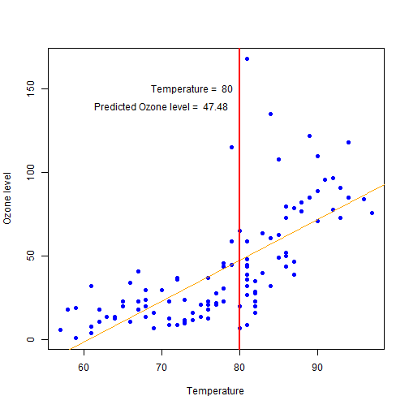

## Ozone level Predictor

This document is aiming at presenting the shiny application Ozone Predictor. The following aspects will be covered:
  
1- Application purpose and user guidelines

2- Calculation applied

3- Displayed result

---

## 1 - Application purpose and user guidelines

This appplication can be used to estimate the potential level of ozone according to a selected temperature. 
  
To calculate this estimate the application uses the air quality dataset as a reference to establish the regression model existing between ozone and temperature. 
  
To predict the level of ozone the user can select a temperature on the left hand side of the screen. The scatter plot in the center displays the data from the air quality data set in blue and the estimated regression line in orange. 
  
Once a temperature is selected the vertical red line in the chart will move accordingly and the label at the top will display the temperature selected and the estimated level of ozone corresponding on the regression line.
  
The user can aslo have direct access to the air quality data by consulting the table under the chart.


---

## 2- Calculation applied

The following code is used by the application to produce the prediction.


```r
##load and format the dataset
data(airquality);dataMain <- data.frame(na.omit(airquality))
dataMain <- dataMain[,c('Ozone','Temp')]
## calculate the regression model from the data and evaluate outcome with predictor at 80
temp <-80;reg <- lm(Ozone ~ Temp,dataMain)
pred <- predict(reg,newdata = data.frame(Temp=temp))
```

  
The estimated level of ozone for a temperature of 80 is 47.4827.

---

## 3- Displayed result

Once the calculation is completed the results are displayed in the following graph:

```r
plot(x=dataMain$Temp,y=dataMain$Ozone,pch = 16, cex = .9,col='blue', xlab='Temperature',ylab = 'Ozone level');abline(reg, col='orange');lines(c(temp, temp), c(-10, 200),col="red",lwd=2);text(80-6, 150, paste("Temperature = ", temp));text(80-10, 140, paste("Predicted Ozone level = ", round(pred, 2)))
```

 


